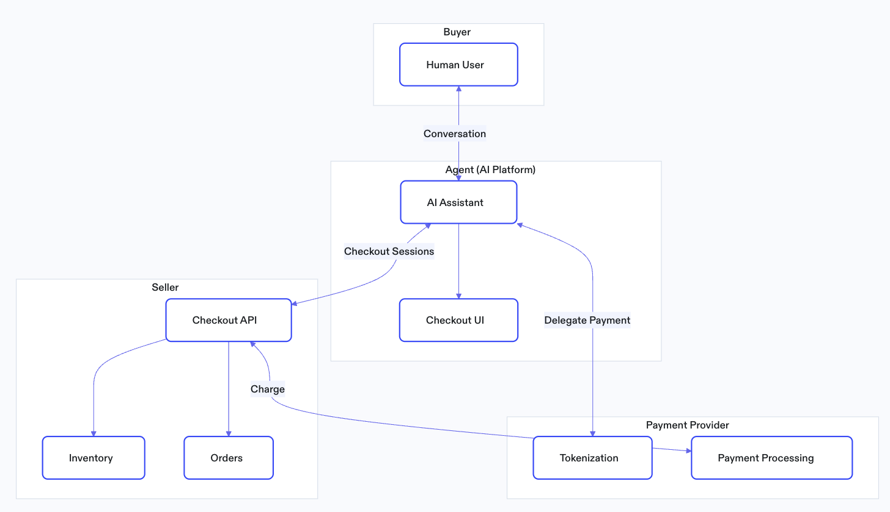

# Agentic Commerce Protocol (ACP) Demo Implementation

On [September 29th](https://openai.com/index/buy-it-in-chatgpt/), OpenAI released the Agentic Commerce Protocol (ACP), which will be foundational for how agents transact with the outside world.  

As an open-source standard, it isn’t limited to ChatGPT — it’s designed to let any LLM client transact with any vendor. This creates an opportunity for devs to start building on top of it today.  

Here is a small demo that can be used to explore this functionality using Frisbii as a PSP. This demo should also allow merchants to test their own implementations.

## Running this demo

### Prerequisites

- Node.js 20+
- Docker & Docker Compose
- OpenAI and/or Anthropic API keys
- Frisbii test account + public API key

### Setup

1. **Clone the repository**
   ```bash
   git clone https://github.com/reepay/reepay-agentic-commerce-demo
   cd reepay-agentic-commerce-demo
   ```

2. **Install dependencies**
   ```bash
   npm install
   ```
   This installs all dependencies across all workspaces (demo services + chat client).

3. **Configure API keys for the chat client**
   ```bash
   cd chat-client
   cp .env.example .env
   # Edit .env and add your OPENAI_API_KEY and/or ANTHROPIC_API_KEY
   cd ..
   ```

4. **Configure the demo ACP to use your specific merchant credentials**
   ```bash
   cd demo/mcp-ui-server
   cp .env.example .env
   # Edit .env
   cd ..
   ```
   Add a public Frisbii API key to the `PSP_CLIENT_API_KEY`, corresponding to the test account you're planning to use.

   When ready to test your own implementation, replace `MERCHANT_BASE_URL` and `MERCHANT_API_KEY` in the same file with relevant values.

4. **Start all services**
   ```bash
   npm run dev
   ```
   This will:
   - Start PostgreSQL databases (via Docker)
   - Start the simulated Merchant API (port 4001)
   - Start the MCP server (port 3112)

5. **Start the chat client** (in a new terminal)
   ```bash
   cd chat-client
   npm run dev
   ```
   Open http://localhost:3000 in your browser.

6. **Try it out!**
   - Ask the agent: "Show me some shirts"
   - Add items to cart
   - Complete checkout with test payment info


## Implementation Details



### Client
The agent client is composed of 2 parts: 
- the AI chat, which could be ChatGPT or any other LLM.
- some UI used for collecting data. This part is implemented in this demo via an MCP server.

This part should be provided by ChatGPT and is not yet available in Europe.

### Merchant
The merchant's backend system. This demo comes with a simulated merchant backend that implements the required endpoints. These are presented in the [checkout spec](https://www.agenticcommerce.dev/docs/reference/checkout).

Once the agent completes the checkout, the merchant simulator calls the PSP (Frisbii) to perform the charge with the provided payment token.

### Payment Provider
This demo uses Frisbii's implementation of the [delegated payment spec](https://www.agenticcommerce.dev/docs/reference/payments). Once a token is created by the agent, the token can be used to fulfill the payment.


## Shopping Workflow
*Also see OpenAI's docs on [checkout spec](https://developers.openai.com/commerce/specs/checkout) and [product feed](https://developers.openai.com/commerce/guides/get-started)* 

### Lookup products
The agent requires a product catalog provided by the merchant and indexes it accordingly. Check the link above for details.

When the user performs a query, the agent will use the indexed catalog to provide relevant recommendations.

### Open a checkout session
When the user first adds an item to the cart, the Client calls:
```http
POST /checkout_sessions
```
-   The request body includes the line items being added.
-   A checkout session state tracks line items, user contact info, and fulfillment address.
    

### Update session state
As the user shops, the Client updates the Merchant each time the cart, contact info, or fulfillment address changes:
```http
POST /checkout_sessions/{checkout_session_id}
```
-   Per ACP spec, the Merchant returns its copy of the updated checkout state.
-   The Client treats this as the source of truth and updates the in-chat UI accordingly.

### Cancel session (optional)
Removing all items from the cart cancels the session. Alternatively, the Client can explicitly cancel by calling:
```http
POST /checkout_sessions/{checkout_session_id}/cancel
```

### Retrieve session details (optional)
For implementations that need it, the Client can fetch details for a session:
```http
GET /checkout_sessions/{checkout_session_id}
```

### Payment / Checkout Workflow
Complete payment
```http
POST /checkout_sessions/{checkout_session_id}/complete
```
This call contains a payment taken, that the Merchant can then use to fulfill a charge.


# Merchant TODOs
Note that ACP is not yet available in Europe. This demo aims to provide an end to end representation of how Agentic Commerce is expected to look like. 

That being said, you can prepare your system in the following ways:
- Check the [specs](https://www.agenticcommerce.dev/docs/reference/checkout) and implement the presented APIs.
- Create a Frisbii public key - this is needed for the agent to comission payment tokens.
- If not already doing so, implement API calls to our [charge endpoint](https://docs.frisbii.com/reference/createcharge).
- Provide OpenAI with details about your products. This is documented [here](https://developers.openai.com/commerce/guides/get-started) and is beyond the scope of this demo.


</br>

---
*Note: This repo is a demo sandbox. All transactions are mocked — no real payments occur.*